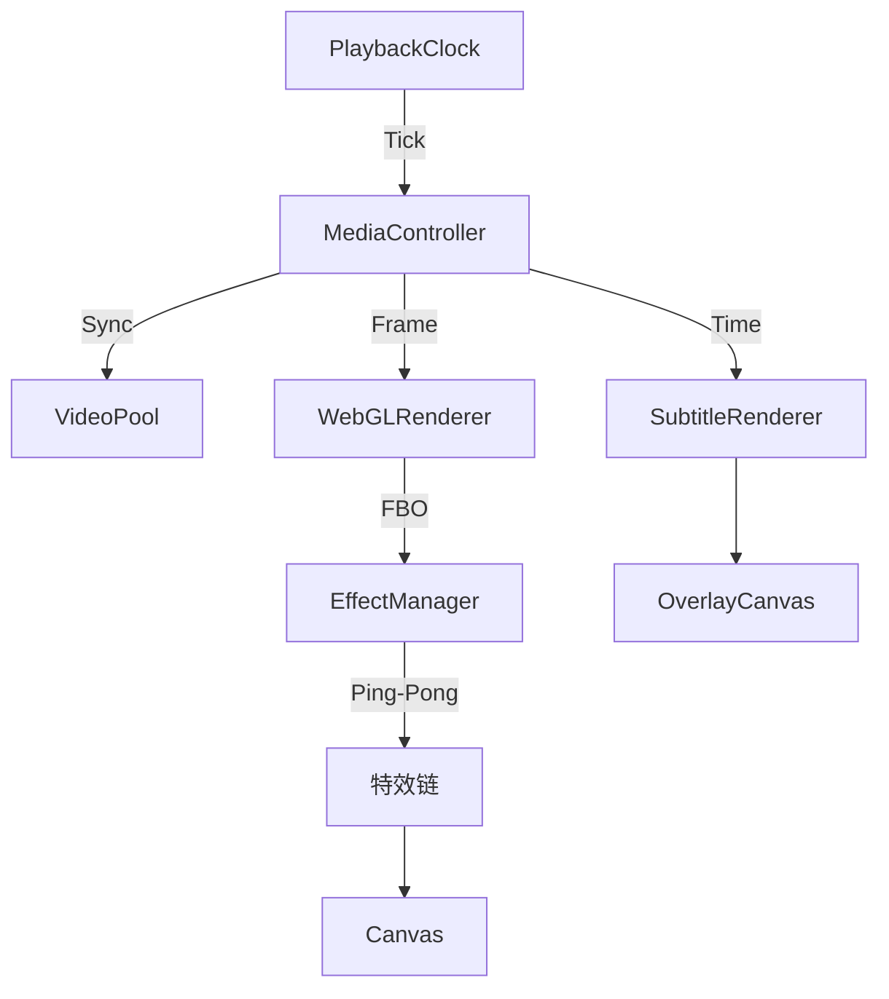

# BaseCut - 高性能 Web 视频剪辑引擎

<p align="center">
  <br>
  
  
  
  
  
  <br>
  <sub>基于 WebGL 与 WebCodecs 的下一代云端视频剪辑解决方案</sub>
</p>

---

## ⚡️ 核心亮点

### 🚀 工业级播放引擎
- **MediaController 架构**：自研多媒体控制器，精确协调视频、音频与字幕同步。
- **VideoPool 预加载技术**：基于 LRU 策略的 6 通道视频池，实现多轨道素材零延迟切换。
- **PlaybackClock 精确计时**：独立于 UI 线程的高精度时钟，消除 `requestAnimationFrame` 带来的累积误差。
- **智能渲染循环**：分离渲染帧率与状态更新频率（20fps UI / 60fps Render），彻底解决 Vue 响应式导致的性能瓶颈。

### 🎨 专业级渲染能力
- **WebGL 硬件加速**：全流程 GPU 图像处理，支持实时滤镜与特效。
- **10+ 视频特效**：闪白、故障、老电影、径向模糊、色差、像素化、暗角、分屏等。
- **Ping-Pong 渲染**：多特效链式叠加，状态隔离确保渲染一致性。
- **多层级合成系统**：支持视频、图片、文字、贴纸等多轨道混合渲染。
- **独立字幕层**：基于 Offscreen Canvas 的高性能字幕渲染，支持动态样式与精确时间轴对齐。

### 🎬 专业导出能力
- **WebCodecs 硬件编码**：利用 GPU 加速视频编码，导出速度提升 3-5 倍。
- **预览导出一致**：统一渲染管线，所见即所得。
- **FBO 预渲染**：确保特效、宽高比在导出时与预览完全一致。

### ☁️ 云原生工作流
- **HLS 流媒体支持**：原生支持 m3u8 流媒体播放，无缝对接云端转码资源。
- **Sprite 缩略图引擎**：支持长视频雪碧图预览，拖拽时间轴实时响应，零卡顿体验。
- **波形可视化**：异步加载音频波形数据，提供精准的音频编辑辅助。

---

## 🛠 技术架构

### 目录结构

```
vue-baseCut/
├── src/
│   ├── engine/                  # 核心播放与渲染引擎
│   │   ├── MediaController.ts   # 多媒体总线控制（核心）
│   │   ├── VideoPool.ts         # 视频元素复用池（性能优化）
│   │   ├── PlaybackClock.ts     # 高精度播放时钟
│   │   ├── WebGLRenderer.ts     # WebGL 渲染器（滤镜/特效/转场）
│   │   ├── EffectManager.ts     # 特效管理器（Ping-Pong 渲染）
│   │   ├── EffectShaders.ts     # GLSL 特效着色器集合
│   │   ├── WebCodecsExporter.ts # WebCodecs 视频导出
│   │   ├── HLSPlayer.ts         # HLS 流播放封装
│   │   └── FFmpegCore.ts        # WASM 媒体处理核心
│   │
│   ├── components/              # UI 组件库
│   │   ├── player/              # 播放器模块
│   │   ├── timeline/            # 时间轴模块
│   │   ├── effect/              # 特效面板
│   │   └── export/              # 导出对话框
│   │
│   ├── stores/                  # 状态管理 (Pinia)
│   │   ├── timeline.ts          # 时间轴状态
│   │   └── effects.ts           # 特效状态
│   │
│   └── types/                   # TypeScript 类型定义
│       └── effects.ts           # 特效类型定义
```

### 渲染流程



---

## 📦 快速开始

### 环境要求
- Node.js 18+
- pnpm 8+

### 安装与运行

```bash
# 1. 安装依赖
pnpm install

# 2. 启动开发服务器
pnpm dev

# 3. 构建生产版本
pnpm build
```

---

## 🎨 支持的视频特效

| 特效 | 描述 | 主要参数 |
|------|------|----------|
| Flash | 闪白效果 | 颜色、强度 |
| Shake | 画面抖动 | 频率、方向 |
| Glitch | 数字故障 | RGB分离、扫描线、块状干扰 |
| Radial Blur | 径向模糊 | 中心点、采样数 |
| Chromatic | 色差效果 | 角度 |
| Pixelate | 像素化 | 像素大小 |
| Invert | 反色 | - |
| Film Grain | 老电影 | 颗粒、划痕、闪烁、复古色调 |
| Vignette | 暗角效果 | 半径、柔和度 |
| Split Screen | 分屏 | 分屏数、方向、间隔 |

---

## 📚 技术博客

深入了解项目实现细节：

1. [技术选型与项目结构](./docs/blog/01-architecture.md)
2. [时间轴数据模型](./docs/blog/02-timeline-state.md)
3. [WebGL 渲染与滤镜](./docs/blog/03-webgl-rendering.md)
4. [转场动画实现](./docs/blog/04-transitions.md)
5. [WebCodecs 视频导出](./docs/blog/05-webcodecs-export.md)
6. [LeaferJS 贴纸系统](./docs/blog/06-leaferjs-sticker.md)
7. [视频特效系统](./docs/blog/07-effect-system.md)
8. [关键帧动画系统](./docs/blog/08-keyframe-animation.md)

---

## 📝 开发路线图

- [x] **v0.1.0**: 基础轨道编辑，WebGL 渲染，HLS 播放
- [x] **v0.2.0**: 播放引擎重构，引入 VideoPool 与 MediaController
- [x] **v0.3.0**: 字幕系统与多轨道层级合成
- [x] **v0.4.0**: 视频特效系统（10+ 特效，Ping-Pong 渲染）
- [x] **v0.5.0**: WebCodecs 硬件加速导出
- [x] **v0.6.0**: 关键帧动画系统
- [ ] **v0.7.0**: 音频特效与可视化

---

<p align="center">
  <sub>Designed for Performance, Built for Creators.</sub>
</p>

