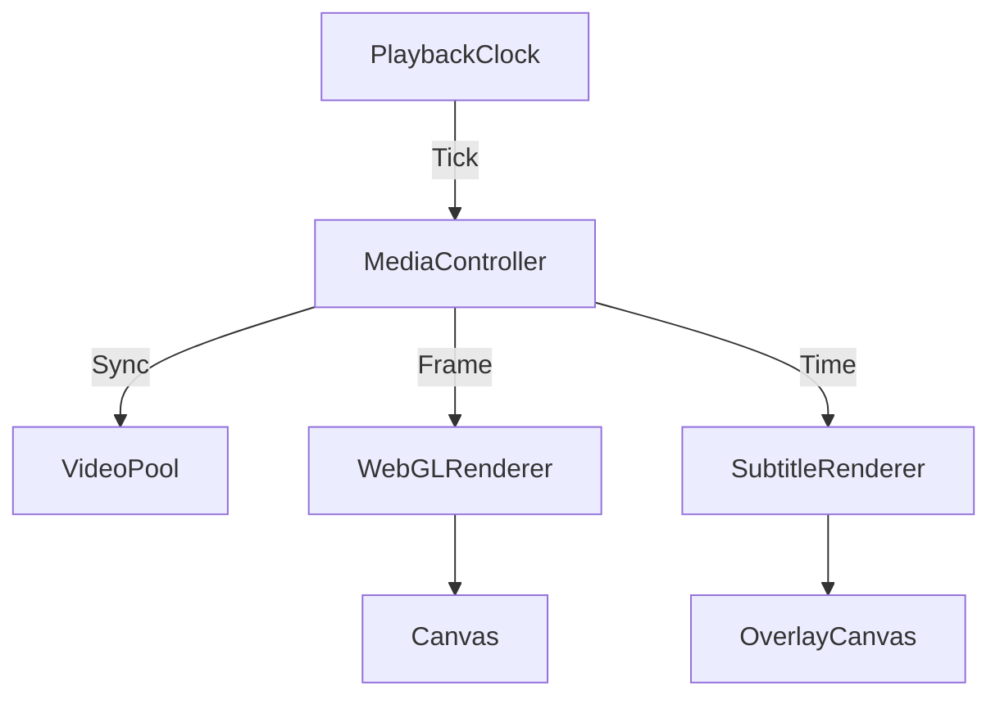

# BaseCut - 高性能 Web 视频剪辑引擎

<p align="center">
  <br>
  
  
  
  
  <br>
  <sub>基于 WebGL 与 HLS 的下一代云端视频剪辑解决方案</sub>
</p>

---

## ⚡️ 核心亮点

### 🚀 工业级播放引擎
- **MediaController 架构**：自研多媒体控制器，精确协调视频、音频与字幕同步。
- **VideoPool 预加载技术**：基于 LRU 策略的 6 通道视频池，实现多轨道素材零延迟切换。
- **PlaybackClock 精确计时**：独立于 UI 线程的高精度时钟，消除 `requestAnimationFrame` 带来的累积误差。
- **智能渲染循环**：分离渲染帧率与状态更新频率（20fps UI / 60fps Render），彻底解决 Vue 响应式导致的性能瓶颈。

### 🎨 专业级渲染能力
- **WebGL 硬件加速**：全流程 GPU 图像处理，支持实时滤镜与特效。
- **多层级合成系统**：支持视频、图片、文字、贴纸等多轨道混合渲染。
- **独立字幕层**：基于 Offscreen Canvas 的高性能字幕渲染，支持动态样式与精确时间轴对齐。

### ☁️ 云原生工作流
- **HLS 流媒体支持**：原生支持 m3u8 流媒体播放，无缝对接云端转码资源。
- **Sprite 缩略图引擎**：支持长视频雪碧图预览，拖拽时间轴实时响应，零卡顿体验。
- **波形可视化**：异步加载音频波形数据，提供精准的音频编辑辅助。

---

## 🛠 技术架构

### 目录结构

```
vue-baseCut/
├── src/
│   ├── engine/                  # 核心播放与渲染引擎
│   │   ├── MediaController.ts   #多媒体总线控制（核心）
│   │   ├── VideoPool.ts         # 视频元素复用池（性能优化）
│   │   ├── PlaybackClock.ts     # 高精度播放时钟
│   │   ├── WebGLRenderer.ts     # WebGL 渲染器
│   │   ├── HLSPlayer.ts         # HLS 流播放封装
│   │   └── FFmpegCore.ts        # WASM 媒体处理核心
│   │
│   ├── components/              # UI 组件库
│   │   ├── player/              # 播放器模块
│   │   │   └── Player.vue       # 播放器主入口（集成渲染循环）
│   │   ├── timeline/            # 时间轴模块
│   │   │   └── ClipThumbnails.vue # 智能缩略图组件
│   │   └── ...
│   │
│   ├── utils/                   # 工具库
│   │   ├── SubtitleRenderer.ts  # 字幕渲染引擎
│   │   └── FrameExtractor.ts    # 帧提取与缓存工具
│   │
│   └── stores/                  # 状态管理 (Pinia)
```

### 渲染流程



---

## 📦 快速开始

### 环境要求
- Node.js 18+
- pnpm 8+

### 安装与运行

```bash
# 1. 安装依赖
pnpm install

# 2. 启动开发服务器
pnpm dev

# 3. 构建生产版本
pnpm build
```

---

## 🔧 核心配置

### HLS 素材配置示例
项目支持自动识别 HLS 流媒体资源。配置 `Material` 对象时：

```typescript
const material = {
  id: 'video_01',
  type: 'video',
  // 优先使用 HLS 流地址
  hlsUrl: 'https://example.com/videos/master.m3u8',
  // 降级使用 Blob URL
  blobUrl: 'blob:http://localhost:3000/...',
  // 配置雪碧图以优化拖拽预览
  filmstrip: {
    url: 'https://example.com/videos/sprite.jpg',
    interval: 1, // 关键帧间隔
    ...
  }
}
```

---

## 📝 开发路线图

- [x] **v0.1.0**: 基础轨道编辑，WebGL 渲染，HLS 播放
- [x] **v0.2.0**: 播放引擎重构，引入 VideoPool 与 MediaController
- [x] **v0.3.0**: 字幕系统与多轨道层级合成
- [ ] **v0.4.0**: 关键帧动画系统
- [ ] **v0.5.0**: 视频转场与 WebCodecs 导出优化

---

<p align="center">
  <sub>Designed for Performance, Built for Creators.</sub>
</p>
